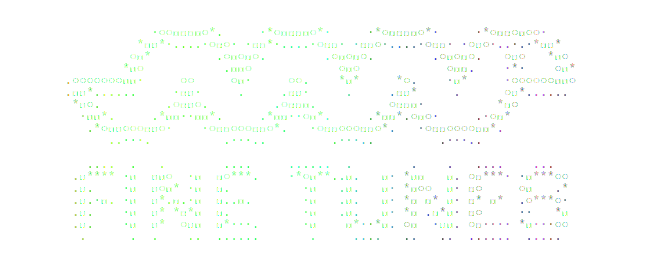
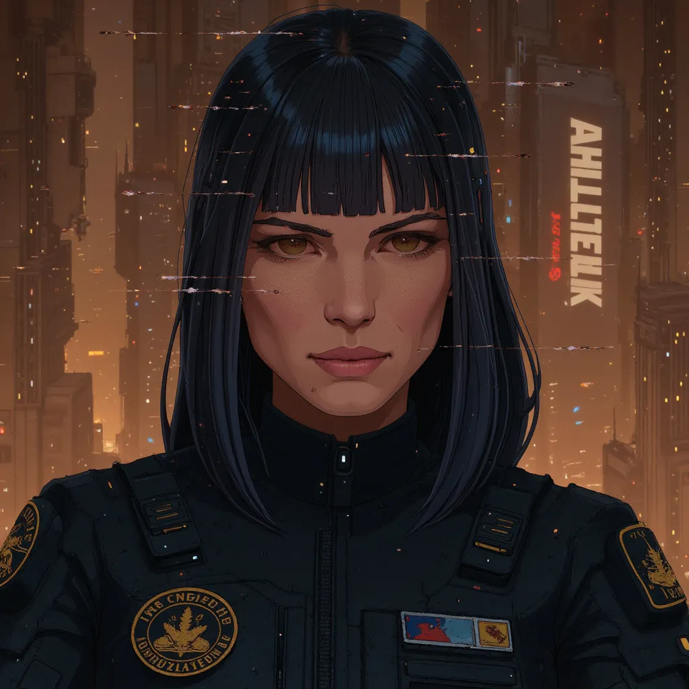
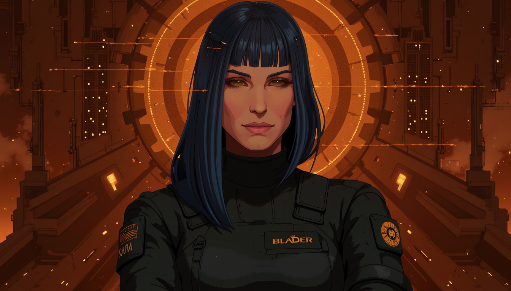
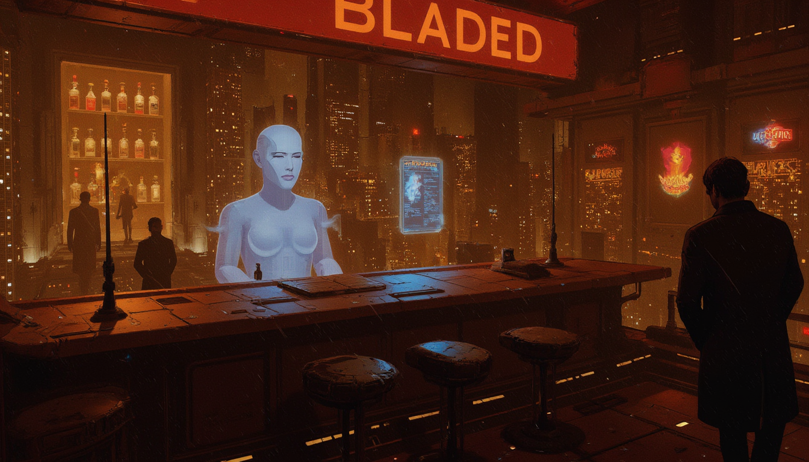
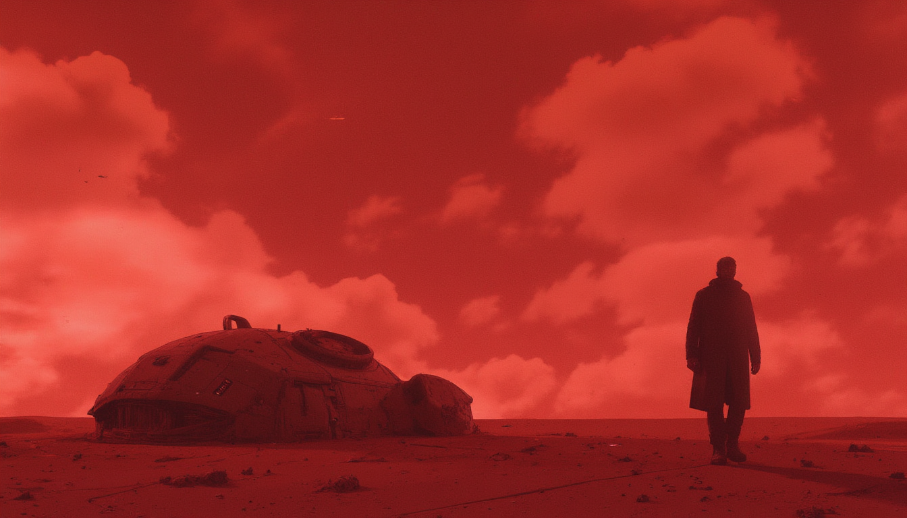
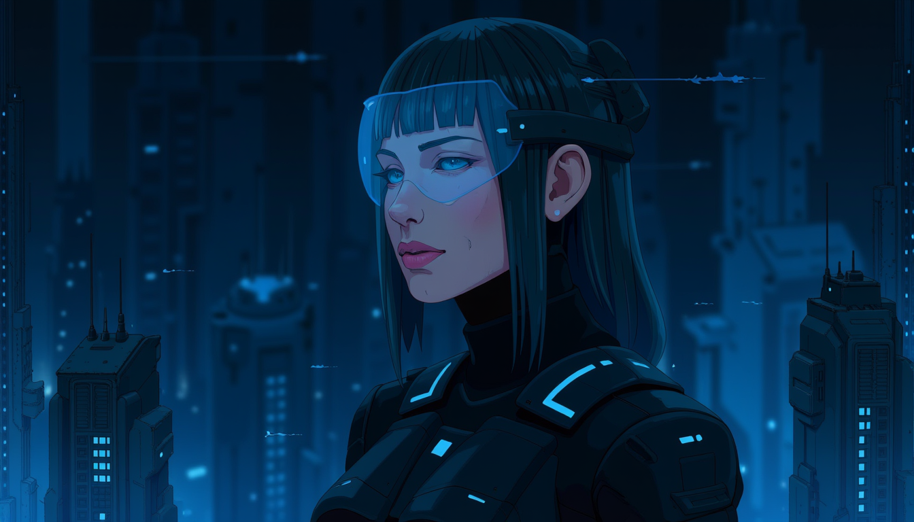
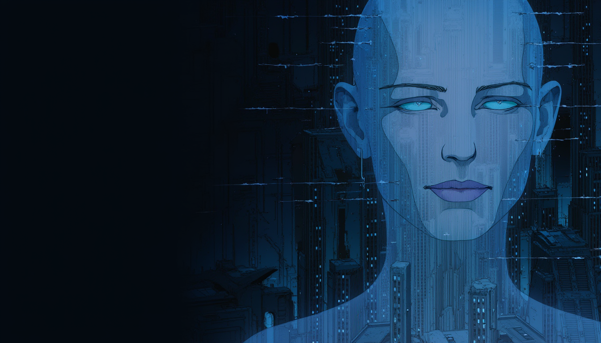

<div align="center">

<picture>
  <source media="(prefers-color-scheme: dark)" srcset="docs/fine_tunes_logo_dark.svg">
  <source media="(prefers-color-scheme: light)" srcset="docs/fine_tunes_logo_light.svg">
  
</picture>

</div>

[Python 3.10+](https://www.python.org/downloads/) • [License: MIT](https://opensource.org/licenses/MIT) • [Replicate](https://replicate.com)

_Train custom AI art models on your style • Generate infinite variations • Transform any image_

**Python CLI wrapper for Replicate's Flux LoRA fine-tuning API.** Train custom image models on your dataset and run inference—all via command line, no GPU setup required.

&nbsp;

## Table of Contents

- [How It Works](#how-it-works)
- [Getting Started](#getting-started)
- [Usage](#usage)
  - [Training a Model](#training-a-model)
  - [Checking Training Status](#checking-training-status)
  - [Generating Images](#generating-images)
  - [Image-to-Image Generation](#image-to-image-generation)
- [Tuning Guide](#tuning-guide)
- [Costs](#costs)
- [Troubleshooting](#troubleshooting)
- [Project Structure](#project-structure)
- [Gallery](#gallery)
- [License](#license)
- [Contributing](#contributing)
- [Acknowledgments](#acknowledgments)

&nbsp;

## How It Works

<p align="center">
  <picture>
    <source media="(prefers-color-scheme: dark)" srcset="docs/diagrams/Pipeline — Dark.svg">
    <source media="(prefers-color-scheme: light)" srcset="docs/diagrams/Pipeline — Light.svg">
    
  </picture>
</p>

```bash
# 1. Train your model
python flux_style_finetune.py train --images-dir ./my_artwork --model-name my-style --username you

# 2. Check training status
python flux_style_finetune.py status

# 3. Generate images
python flux_style_finetune.py generate --prompt "your prompt" --model-name my-style --username you

# 3b. Transform existing images (img2img)
python flux_style_finetune.py generate --image ./photo.jpg --prompt "style it" --model-name my-style --username you
```

&nbsp;

&nbsp;

## Getting Started

<p align="center">
  <picture>
    <source media="(prefers-color-scheme: dark)" srcset="docs/diagrams/Prerequisites Checklist — Dark.svg">
    <source media="(prefers-color-scheme: light)" srcset="docs/diagrams/Prerequisites Checklist — Light.svg">
    
  </picture>
</p>

### Installation

1. **Clone this repository**:

```bash
# Clone and navigate to the project
git clone https://github.com/yourusername/flux-tuning.git
cd flux-tuning
```

2. **Install dependencies**:

```bash
# Install required Python packages
pip install -r requirements.txt
```

3. **Set up your Replicate API token**:

Get your token from [https://replicate.com/account/api-tokens](https://replicate.com/account/api-tokens) or create a `.env` file with:

```
REPLICATE_API_TOKEN=r8_your_token_here
```

&nbsp;

&nbsp;

## Usage

### Training a Model

Train a new style model using your reference images:

```bash
# Train with custom trigger word and step count
python flux_style_finetune.py train \
  --images-dir ./my_artwork \
  --model-name my-art-style \
  --username your_replicate_username \
  --trigger-word MYART \
  --steps 1000
```

**Parameters**:

- `--images-dir` (required): Directory containing your training images
- `--model-name` (required): Name for your model (lowercase, hyphens allowed)
- `--username` (required): Your Replicate username
- `--trigger-word` (optional): Unique word to activate the style (default: MYSTYLE)
- `--steps` (optional): Training steps, more steps = better quality but higher cost (default: 1000)

**What happens**:

1. Validates your images (minimum 2, recommends 10-20)
2. Bundles images and any matching `.txt` caption files
3. Creates a training archive
4. Starts training on Replicate (~10-20 minutes)
5. Saves training metadata locally for easy status checks

**Cost**: Approximately $1.50 for 1000 steps with 20 images.

#### Custom Captions

To provide custom captions for your training images, create `.txt` files with the same name as your images:

```
my_artwork/
├── image1.jpg
├── image1.txt       # "a dramatic sunset over mountains"
├── image2.png
└── image2.txt       # "a serene forest landscape"
```

The tool will automatically include caption files when creating the training archive.

### Checking Training Status

Check on your training progress:

```bash
# Check latest training
python flux_style_finetune.py status

# Check specific training by ID
python flux_style_finetune.py status --training-id <training_id>
```

Shows:

- Current status (starting/processing/succeeded/failed)
- Elapsed time
- Link to detailed logs
- Instructions for generating images once complete

### Generating Images

Once training is complete, generate images in your style:

```bash
# Generate multiple images in widescreen format
python flux_style_finetune.py generate \
  --prompt "a magical forest at sunset" \
  --model-name my-art-style \
  --username your_replicate_username \
  --num-outputs 2 \
  --aspect-ratio 16:9
```

**Parameters**:

- `--prompt` (required): Text description of what you want to generate
- `--model-name` (required): Name of your trained model
- `--username` (required): Your Replicate username
- `--num-outputs` (optional): Number of images to generate, 1-4 (default: 1)
- `--aspect-ratio` (optional): Image dimensions (default: 1:1)
  - Options: `1:1`, `16:9`, `9:16`, `4:3`, `3:4`
- `--output-dir` (optional): Where to save images (default: ./outputs)
- `--guidance-scale` (optional): How closely to follow the prompt, 1.0-10.0 (default: 3.5)
- `--num-inference-steps` (optional): Quality vs speed tradeoff, 1-50 (default: 28)
- `--lora-scale` (optional): Strength of style application, 0.0-2.0 (default: 1.0)

**Trigger word**: The tool automatically prepends your trigger word (e.g., "In the style of MYART") if not already in the prompt.

### Image-to-Image Generation

Transform existing images using your trained style:

```bash
# Transform an existing image with your style
python flux_style_finetune.py generate \
  --prompt "transform into watercolor painting" \
  --model-name my-art-style \
  --username your_replicate_username \
  --image ./input_photo.jpg \
  --prompt-strength 0.7 \
  --aspect-ratio 16:9
```

**Additional Parameters for img2img**:

- `--image` (required for img2img): Path to input image to transform
- `--prompt-strength` (optional): How much to transform the input, 0.0-1.0 (default: 0.8)
  - `0.0-0.3`: Subtle style transfer, preserves most details
  - `0.4-0.6`: Balanced transformation
  - `0.7-1.0`: Strong transformation, more creative interpretation

**Use cases**:

- Apply your artistic style to photographs
- Iterate on generated images
- Create variations of existing artwork
- Style transfer between different art styles

&nbsp;

&nbsp;

## Tuning Guide

### LoRA Scale Control

Fine-tune how strongly your trained style is applied:

```bash
# Adjust style strength with lora-scale
python flux_style_finetune.py generate \
  --prompt "a serene landscape" \
  --model-name my-art-style \
  --username your_replicate_username \
  --lora-scale 0.8
```

<p align="center">
  <picture>
    <source media="(prefers-color-scheme: dark)" srcset="docs/diagrams/LoRA Scale Guide — Dark.svg">
    <source media="(prefers-color-scheme: light)" srcset="docs/diagrams/LoRA Scale Guide — Light.svg">
    
  </picture>
</p>

### Combining Parameters

Create sophisticated generations by combining parameters:

```bash
# Strong style, subtle transformation of input image
python flux_style_finetune.py generate \
  --prompt "epic mountain vista" \
  --model-name my-art-style \
  --username your_replicate_username \
  --image ./photo.jpg \
  --lora-scale 1.3 \
  --prompt-strength 0.5 \
  --guidance-scale 6.0 \
  --aspect-ratio 16:9 \
  --num-outputs 4
```

### Training Data

- **Quality over quantity**: 10-20 high-quality images work better than 50 mediocre ones
- **Consistency**: Images should represent a cohesive style
- **Variety**: Include different subjects, compositions, and lighting
- **Resolution**: Higher resolution images (1024px+) train better
- **Clean images**: Avoid watermarks, text, or UI elements
- **Custom captions**: Use `.txt` files for precise image descriptions

### Trigger Words

- Use **unique, non-dictionary words** (e.g., "ZNDRART", "MYSTL") to avoid conflicts
- Keep it **short and memorable** (one word preferred)
- **Capitalize** to distinguish from normal prompt text

### Parameter Quick Reference

| Parameter             | Range    | Sweet Spot | Effect                                 |
| --------------------- | -------- | ---------- | -------------------------------------- |
| `guidance-scale`      | 1.0-10.0 | 3.5-6.0    | Higher = more prompt adherence         |
| `lora-scale`          | 0.0-2.0  | 1.0-1.2    | Higher = stronger style                |
| `prompt-strength`     | 0.0-1.0  | 0.5-0.7    | (img2img) Higher = more transformation |
| `num-inference-steps` | 1-50     | 28-35      | Higher = better quality, slower        |

⚠️ **Note**: More training steps can lead to overfitting. Start with 1000 and adjust based on results.

&nbsp;

&nbsp;

## Costs

<p align="center">
  <picture>
    <source media="(prefers-color-scheme: dark)" srcset="docs/diagrams/Costs — Dark.svg">
    <source media="(prefers-color-scheme: light)" srcset="docs/diagrams/Costs — Light.svg">
    
  </picture>
</p>

**Pro tip**: Use `--num-outputs 4` to generate 4 variations at once — it's faster and more cost-effective than running 4 separate generations.

&nbsp;

&nbsp;

## Troubleshooting

### "REPLICATE_API_TOKEN not set"

Make sure you've exported the environment variable:

```bash
# Set your Replicate API token
export REPLICATE_API_TOKEN=r8_your_actual_token
```

### "Model not found"

Double-check:

- Your username is spelled correctly
- The model name matches what you used during training
- Training completed successfully (run `status` command)

### "Rate limit" errors

The tool automatically retries with exponential backoff. If it persists, wait a minute and try again.

### Training failed

Check the logs URL provided in the output. Common issues:

- Images too small or corrupted
- Insufficient variety in training data
- Not enough disk space

### Poor quality generations

Try adjusting:

- Increase `--guidance-scale` (5.0-6.0) for more prompt adherence
- Adjust `--lora-scale` (0.8-1.2) to control style strength
- Use more specific prompts with detailed descriptions
- Check the [PROMPTS.md](PROMPTS.md) library for proven examples

### Image-to-image not working as expected

- Lower `--prompt-strength` (0.4-0.6) to preserve more of the input image
- Higher `--prompt-strength` (0.7-0.9) for more dramatic transformations
- Ensure input image is high quality (1024px+ recommended)

&nbsp;

&nbsp;

## Project Structure

```
flux-tuning/
├── flux_style_finetune.py    # Main CLI script
├── requirements.txt           # Python dependencies
├── .gitignore                 # Git ignore patterns
├── .env.example               # Environment variable template
├── README.md                  # This file
├── PROMPTS.md                 # Comprehensive prompt library
├── docs/
│   └── diagrams/              # SVG diagrams for README
└── outputs/                   # Generated images (created automatically)
```

&nbsp;

&nbsp;

## What I Created

### Model: Android Dream v4

**[View on Replicate →](https://replicate.com/interfaceconjurer/android-dream-v4)**

A custom Flux LoRA model trained on painterly illustrated poster art inspired by Blade Runner 2049. The style features atmospheric cyberpunk cityscapes with dramatic scale — tiny silhouetted figures dwarfed by massive holographic projections and towering brutalist architecture. Defined by bold warm-vs-cool color palettes (orange and red ground planes against blue-teal structures), heavy atmospheric perspective, soft diffused edges, and moody god rays cutting through fog. Compositions emphasize vertical depth, dystopian grandeur, and contemplative isolation.

<p align="left">
  
</p>

#### Model Specifications

| Property                   | Value                  |
| -------------------------- | ---------------------- |
| **Trigger Word**           | `BLADED`               |
| **Training Steps**         | `2000` steps           |
| **Training Images**        | `7` captioned images   |
| **Recommended LoRA Scale** | `1.0` (range: 0.8-1.2) |
| **Best Aspect Ratios**     | `9:16`, `16:9`, `1:1`  |

#### Generation Examples

<table>
  <tr>
    <td></td>
    <td></td>
    <td></td>
  </tr>
  <tr>
    <td></td>
    <td></td>
    <td></td>
  </tr>
</table>

For prompt inspiration, see [PROMPTS.md](PROMPTS.md) — a collection of 30+ battle-tested prompts with parameters and usage notes.

&nbsp;

&nbsp;

## License

MIT License - feel free to use and modify as needed.

&nbsp;

&nbsp;

## Contributing

Issues and pull requests welcome! This is a community tool designed to make Flux fine-tuning accessible.

&nbsp;

&nbsp;

## Acknowledgments

- Built on [Replicate](https://replicate.com) infrastructure
- Uses [Ostris Flux LoRA Trainer](https://replicate.com/ostris/flux-dev-lora-trainer)
- Flux models by Black Forest Labs
